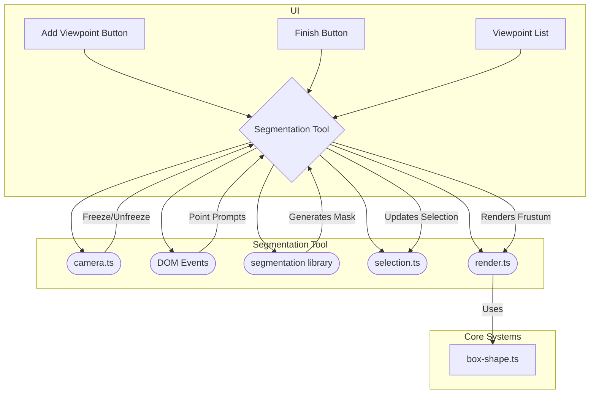
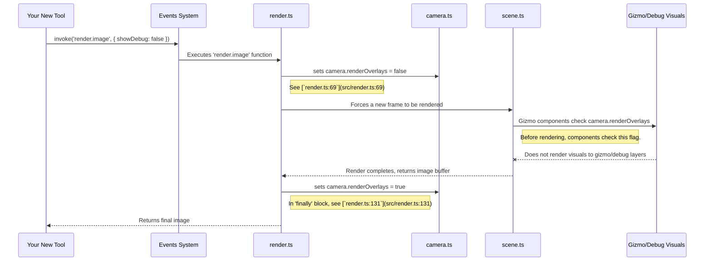

I am trying to implement a segmentation tool for this codebase, the expected UI interaction is:
* the user can "add a viewpoint", once clicked, the editor will freeze at current viewpoint, and user can give positive / negative point prompts to control the mask (likely implemented via SAM2)
* after user is happy with the mask, it clicks "finish adding", then the mask will be used to calculate splats inside the mask, and an appropriate frustrum bbox will be added to the 3D scene for reference
* the user can add more viewpoints, selection across different viewpoints are intersected
* the user can also decide to remove viewpoints, the selection will be updated accordingly
* once user clicks "use selection", the final 3D mask will be used

Please analyze the codebase and point out any snippets or existing code I can refer to fully implement this functionality.


---

Of course. Implementing a segmentation tool with multi-viewpoint selection requires integrating a few different systems already present in the codebase. Here is an analysis of the existing code and a guide on how you can implement the described functionality.

### 1. Creating a New Selection Tool

The most relevant starting point is the existing selection tools. You should create a new tool, perhaps named `segmentation-tool.ts`, in the [`src/tools/`](src/tools) directory. This new tool should follow the pattern of the other tools in that directory, especially [`src/tools/polygon-selection.ts`](src/tools/polygon-selection.ts:0), which is the most similar in concept.

Your new tool will need to be managed by the [`ToolManager`](src/tools/tool-manager.ts:0). You'll need to instantiate it and add it to the manager, likely within [`src/editor.ts`](src/editor.ts:0) where other tools are initialized.

**Key files to reference:**
*   [`src/tools/polygon-selection.ts`](src/tools/polygon-selection.ts:0): A great template for how a tool can capture 2D input and use it to select 3D objects.
*   [`src/tools/tool-manager.ts`](src/tools/tool-manager.ts:0): To understand how to register and activate your new tool.
*   [`src/editor.ts`](src/editor.ts:0): To see how other tools are instantiated and added to the UI.

### 2. Freezing the Viewpoint and User Interaction

When the user clicks "add a viewpoint," you'll need to:

1.  **Freeze the camera:** You can disable the camera controls. The main camera logic is in [`src/camera.ts`](src/camera.ts:0). You can get the camera controller from the `editor.app.scene` and disable its controls.
2.  **Capture point prompts:** You'll need to capture mouse clicks for positive and negative points. The `PolygonSelectionTool` in [`src/tools/polygon-selection.ts`](src/tools/polygon-selection.ts:0) shows how to handle mouse events on the canvas. You can adapt this to store the coordinates of the user's clicks.

```typescript
// Example adapted from polygon-selection.ts for capturing points
// in your new segmentation-tool.ts

// onEnable()
this.app.on('mouse:down', this.onMouseDown, this);

// onMouseDown(e: MouseEvent)
if (e.button === 0) {
    // record positive prompt point
    const rect = this.app.canvas.getBoundingClientRect();
    const x = e.clientX - rect.left;
    const y = e.clientY - rect.top;
    // store this point
}
```

### 3. Generating and Using the Mask

After the user provides prompts, you will use the SAM2 model to get a 2D mask.

1.  **Selecting Splats from the Mask:** Once you have the 2D mask, you need to find which splats fall within it from the current viewpoint. The [`src/shaders/intersection-shader.ts`](src/shaders/intersection-shader.ts:0) and the selection tools use a GPU-based approach to do this efficiently. They render splat IDs to a texture and then read back the pixels under the selection area. You can adapt this to use your mask. You would render the scene from the frozen viewpoint and then use the mask to check which splat IDs are visible within it.

2.  **Storing Viewpoint Selections:** Each time the user "finishes adding" a viewpoint, you should store the set of selected splat indices and the camera's view-projection matrix.

    ```typescript
    interface ViewpointSelection {
        splatIndices: Set<number>;
        viewProjMatrix: pc.Mat4;
        frustum: pc.BoundingBox; // Or frustum planes
    }
    ```

### 4. Intersecting and Updating Selections

As the user adds or removes viewpoints, you'll update the final selection.

*   **Intersection:** When a new viewpoint is added, you will intersect its `splatIndices` with the currently active selection.
*   **Removal:** When a viewpoint is removed, you will need to recalculate the selection from the remaining viewpoints.

The core selection state is managed in [`src/selection.ts`](src/selection.ts:0). You can interact with it to update the final selection.

```typescript
// In your tool, when updating the final selection
const finalSplatIndices = this.recalculateSelection();
this.app.fire('splat:selection', Array.from(finalSplatIndices));
```

### 5. Displaying the Frustum Bounding Box

To give the user a visual reference, you can display a bounding box or a frustum for each viewpoint. The file [`src/box-shape.ts`](src/box-shape.ts:0) provides a good example of how to create and render a box shape in the scene. You can create a box that represents the camera frustum used for a particular selection.

### 6. UI Implementation

You will need to add buttons like "Add Viewpoint", "Finish Adding", and "Use Selection" to the UI. The [`src/ui/right-toolbar.ts`](src/ui/right-toolbar.ts:0) and [`src/ui/bottom-toolbar.ts`](src/ui/bottom-toolbar.ts:0) show how to add buttons and associate them with actions. You can also create a new panel in the UI to list the added viewpoints and allow their removal.

This diagram illustrates the proposed architecture:



By referencing these parts of the codebase, you should have a solid foundation for implementing your segmentation tool.

---

Based on my analysis of the codebase, you can get a render result containing only the gaussian splats by invoking the `'render.image'` or `'render.video'` event with the `showDebug` property set to `false`.

### How to Get a Splat-Only Render

Here is a code example of how you would trigger an image render without overlays:

```typescript
// 'events' is an instance of the Events class from src/events.ts
// 'imageSettings' is an object conforming to the type in src/render.ts

const imageSettings = {
    width: 1920,
    height: 1080,
    transparentBg: true,
    showDebug: false // Set this to false to hide overlays
};

events.invoke('render.image', imageSettings);
```

### How It Works

The rendering pipeline uses a system of layers to separate the main scene content (the gaussian splats) from auxiliary visuals like transform gizmos and debug information. The visibility of these overlay layers is controlled by the `renderOverlays` property on the main camera object.

Here is a step-by-step breakdown of the process:



1.  **Layer Setup**
    The application initializes several distinct rendering layers in [`scene.ts`](src/scene.ts:1). The important ones for this process are the `debugLayer` and `gizmoLayer`.
    *   [`scene.ts:161`](src/scene.ts:161): The `debugLayer` is created for debug visuals.
    *   [`scene.ts:177`](src/scene.ts:177): The `gizmoLayer` is created for tool handles and gizmos.

2.  **Camera Configuration**
    When the main camera is initialized in [`camera.ts`](src/camera.ts:1), it is configured to render these overlay layers in addition to the main world content.
    *   [`camera.ts:239-243`](src/camera.ts:239-243): The camera's layer list is explicitly extended to include `debugLayer` and `gizmoLayer`.

3.  **Triggering a Clean Render**
    The rendering functions in [`render.ts`](src/render.ts:1) accept a `showDebug` flag. When you call `'render.image'` or `'render.video'`, this flag is used to temporarily toggle the `renderOverlays` property on the camera.
    *   [`render.ts:69`](src/render.ts:69): `scene.camera.renderOverlays = showDebug;`
    *   [`render.ts:173`](src/render.ts:173): The same logic is applied for video rendering.

4.  **Conditional Rendering**
    While the layers remain technically active, the individual components responsible for drawing gizmos and other debug visuals (for example, the transform tools) check the value of `camera.renderOverlays` before they draw themselves. If `renderOverlays` is `false`, they skip their drawing routines for that frame.

5.  **Restoration**
    After the offscreen render is complete, the `finally` block in the rendering function ensures that `camera.renderOverlays` is set back to `true`, so that all gizmos and UI elements reappear for normal interactive use.
    *   [`render.ts:131`](src/render.ts:131): `scene.camera.renderOverlays = true;`

By setting `showDebug: false` in your tool, you leverage this existing mechanism to produce a clean render of just the splats.